# UK RAILWAY STATION OPERATIONS & PERFORMANCE ANALYSIS
---

# Table of Contents
---
- [Analysis Overview](#analysis-overview)
- [Objectives](#objectives)
- [Data Source](#data-source)
- [Dataset Overview](#dataset-overview)
- [Tools Used](#tools-used)
- [Data Cleaning & Preparation](#data-cleaning--preparation)
- [Skills Demonstrated](#skills-demonstrated)
- [KPI Overview](#kpi-overview)
- [Insights](#insights)
- [Recommendations](#recommendations)
- [Dashboard](#dashboard)
- [Conclusion](#conclusion)

---

## Analysis Overview
---
Across 9 major UK railway stations, journeys were
being delayed and cancelled but operations teams
had no clear picture of where delays were
concentrated, when they were most likely to happen,
or what was actually causing them.

This project analyses 31,653 passenger journey
records from January to April 2024 to answer one
central question: are railway delays random system
failures, or are they predictable and preventable?

The answer is clear they are predictable.
And that changes everything about how to fix them.

---

## Objectives
---

- Identify the stations with the highest delays and the main causes behind them.
- Compare delay causes and refund rates across **Advance, Anytime, and Off-Peak** ticket types.
- Discover when delays are most likely to occur based on the **day of the week** and **hour of the day**.
- Provide practical, data-driven recommendations that station managers can use to improve railway operations.

---

## Data Source
---

- **Source:** UK National Rail transaction records
- **Period:** January 2024 – April 2024
- **Dataset Size:** 31,653 passenger journey records
- **Stations Covered:** 9 major UK railway stations
- **Ticket Types:** Advance, Anytime, and Off-Peak
- **Journey Status:** On Time, Delayed, and Cancelled
- **Ticket Class:** Standard and First Class
- **Delay Cause Categories:** 7 categories, including Signal Failure, Weather, Technical Issues, Staff Shortage, and more

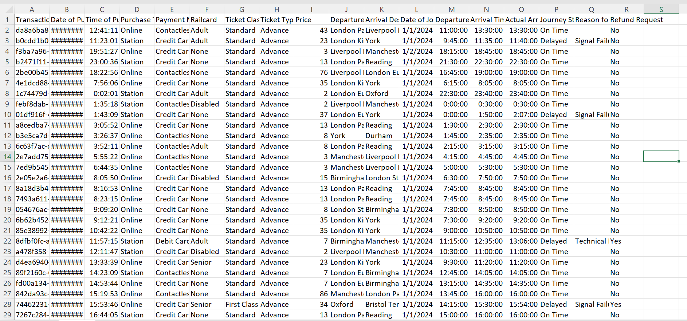

---

## Dataset Overview
---

| Dimension | Detail |
|-----------|--------|
| Total Records | 31,653 |
| Departure Stations | 9 major UK stations |
| Ticket Types | Advance, Anytime, Off-Peak |
| Ticket Classes | Standard, First Class |
| Journey Statuses | On Time, Delayed, Cancelled |
| Delay Cause Categories | 7 categories |
| Data Period | January – April 2024 |

---

## Tools Used
---

- **Microsoft Excel:** Used for data cleaning, creating calculated columns, and building the interactive dashboard, including KPI cards, charts, slicers, and visualizations.

- **Excel Data Model:** Used to create calculated columns such as delay minutes, delay flag, refund flag, year, month, day of the week, and departure hour to support analysis.

- **DAX:** Used to create custom measures, including Average Delay, Refund Rate, Cancellation Rate, and Percentage of Delayed Journeys.
---
 ### Key DAX Measures Used
---

The following DAX measures were created to support the dashboard analysis.

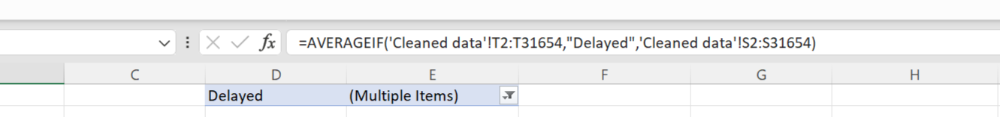

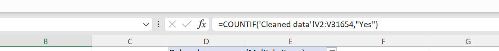

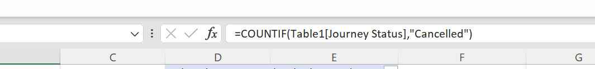

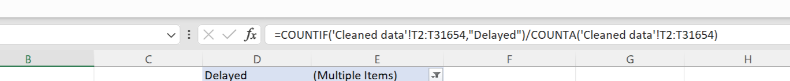
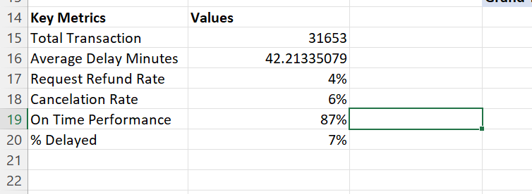

---

## Data Cleaning & Preparation
---

Before the analysis, the dataset was cleaned and prepared in Microsoft Excel to ensure accurate calculations and reliable insights.

### Step 1 — Handled Missing Values

Blank values in the **Reason for Delay** and **Railcard** columns were replaced with **"None."**

For cancelled journeys, missing delay values were filled with **"N/A"** so they would not affect the average delay calculation.

---

### Step 2 — Created New Calculated Columns

Several calculated columns were created to support KPI calculations and dashboard visualizations.

- **Delay (minutes)** — Stores the delay time for each delayed journey.
- **Delay Flag** — Returns **1** for delayed journeys and **0** otherwise.
- **Refund Flag** — Returns **1** when a refund was requested and **0** otherwise.
- **Year** — Extracted from the journey date.
- **Month** — Created for monthly trend analysis.
- **Day of the Week** — Used to identify weekly patterns.
- **Hour of Departure** — Used to analyze delays by time of day.

---

### Step 3 — Standardized Data Formats

Date columns were formatted consistently, and the price column was standardized to ensure accurate calculations across the analysis.

---

### Step 4 — Applied Conditional Formatting

Conditional formatting was used to highlight journeys with delays greater than zero minutes, making delayed records easier to identify during data review.

---

After cleaning, the dataset was reviewed and prepared for dashboard development and analysis.

---

Below are screenshots showing key parts of the data preparation process:

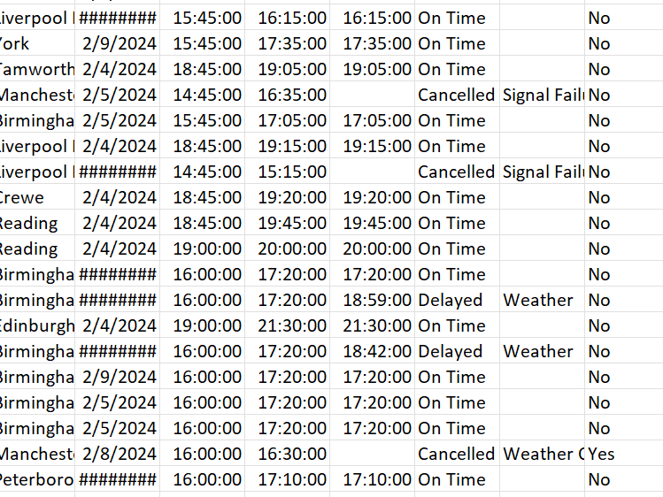

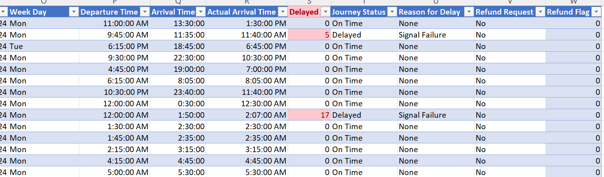

---

## Skills Demonstrated
---

- Data cleaning and data preparation in Excel  
- Handling missing values and data quality checks  
- Calculated column creation for analytics and KPI development  
- DAX measure development for business metrics  
- Pivot table analysis and data aggregation  
- Interactive dashboard design using slicers and filters  
- Time-series analysis (daily, monthly, and hourly trends)  
- Segmentation analysis (by station, ticket type, and class)  
- Root cause analysis of operational delays  
- Data storytelling and business insight communication  
---

## KPI Overview
---

The KPI cards show the following:

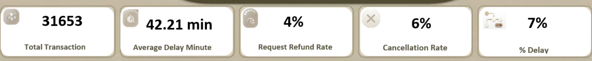

---

## Insights
---

### Insight 1 — Delays are concentrated in a few stations, not spread evenly across the network

Manchester Piccadilly has the highest average delay at 60 minutes, followed by London Euston at 54 minutes. These two stations increase the overall network average delay to 42 minutes. Edinburgh Waverley records the lowest average delay at just 15 minutes.

Signal failure is the leading cause of delays at every station, showing that the issue is mainly related to infrastructure rather than daily operations.

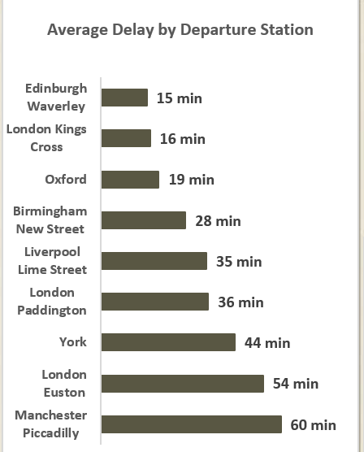

---
### Insight 2 — Delays peak on Wednesdays at 8–9 AM due to high passenger demand

Wednesday records the highest average delays, followed by Tuesday and Thursday. This pattern matches the busiest travel days rather than an increase in technical faults.

Delays also peak between 8–9 AM during the morning rush hour, with weather conditions making disruptions worse around 8 AM. This shows that delays follow a predictable pattern.

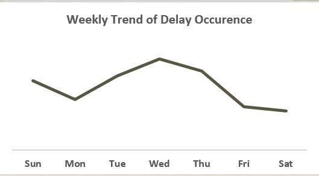

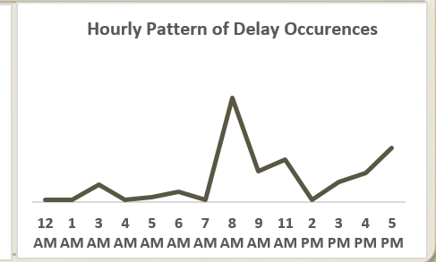

---
### Insight 3 — Off-Peak passengers experience the worst delays and highest refund requests

Off-Peak ticket holders experience the longest average delays at 49 minutes and have the highest refund request rate at 4.22%.

Despite facing the poorest service, these passengers do not receive automatic compensation. Instead, they must submit refund requests themselves, leaving many eligible passengers uncompensated.

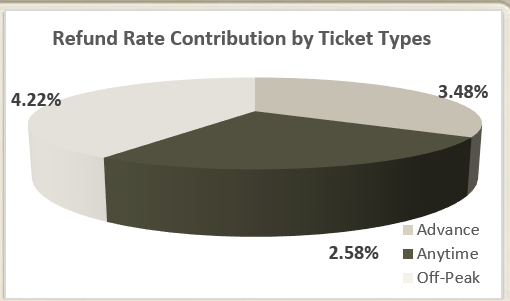

---
### Insight 4 — Standard and First-Class passengers experience the same delay causes

Both Standard and First-Class passengers are affected by the same delay causes, with signal failure ranking first and weather second.

There is no meaningful difference between ticket classes, indicating that delays are driven by network infrastructure rather than service level.

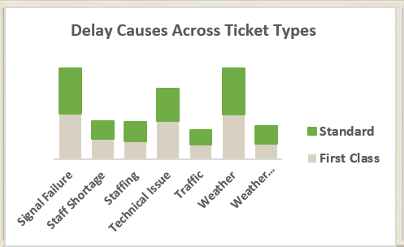

---
### Insight 5 — Birmingham New Street shows a distinct station-specific failure pattern

While most stations are dominated by signal failure, Birmingham New Street shows a higher proportion of equipment-related failures. This makes it an outlier in the network and suggests a station-specific operational issue rather than a network-wide problem.
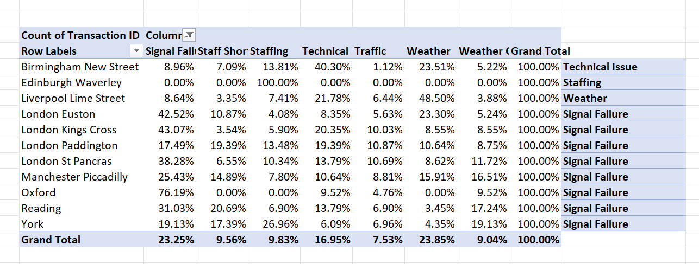

---
## Recommendations

---

### Infrastructure Improvements

- Prioritise signal system upgrades at Manchester Piccadilly, London Euston, King's Cross, York, Liverpool Lime Street, London Paddington, and Reading, as these stations account for the highest share of delay minutes.

### Station-Specific Actions

- Deploy a dedicated quick-response maintenance team at Birmingham New Street to address recurring equipment failures.
  
### Operations & Staffing

- Increase staffing and operational monitoring on Tuesday–Thursday, especially during the 8–9 AM morning peak period.

- Improve train scheduling and passenger flow at the busiest stations to reduce congestion and delays.

### Customer Experience

- Introduce automatic refunds for Off-Peak passengers when delays exceed 30 minutes.

- Provide real-time delay alerts via SMS and mobile app to all passengers, regardless of ticket class.

### Weather & Disruption Preparedness

- Use 24-hour weather forecasts to prepare operations in advance, including track inspections and contingency planning before the morning peak period.
---

## Dashboard

An interactive Excel dashboard was built to analyse UK railway performance across key metrics, including delays, station performance, ticket types, and refund rates.

It includes KPI cards, station-level delay analysis, delay causes by ticket type, refund rates, and time-based trends (day and hour), with slicers for filtering by station, ticket type, and month.

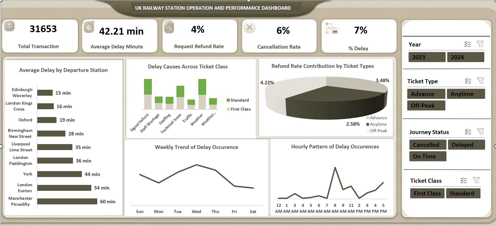

---

## Conclusion
---
This analysis of 31,653 UK railway journey records
proves that delays are not random but they are
concentrated, demand-driven and fixable.

Signal failure is the dominant root cause across
all 9 stations. Manchester Piccadilly and London
Euston pull the entire network average up. Delays
peak predictably on Wednesdays at 8–9 AM driven
by passenger volume, not system breakdown. Off-Peak
passengers carry the heaviest delay burden and
receive the least compensation. And Birmingham
New Street has a distinct technical issue that
requires its own targeted solution.

All seven recommendations are evidence-backed,
specific and actionable by operations teams
without waiting for a major budget cycle.

The path forward is clear. The data has already
shown the way.

---

Thank you for reading.

Let's connect:

[LinkedIn](https://www.linkedin.com/in/peace-ada-95b341341)
[Portfolio](https://peace-ada.github.io/Data-Portfolio/)
[Email](mailto:peaceada100@gmail.com)
